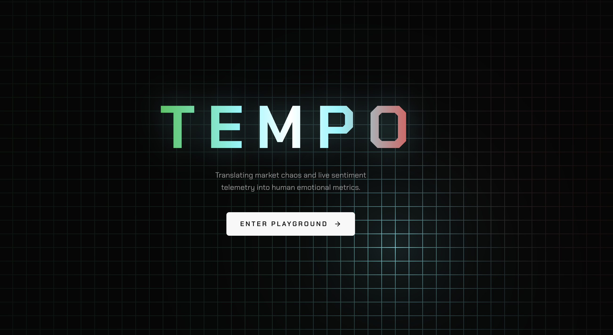
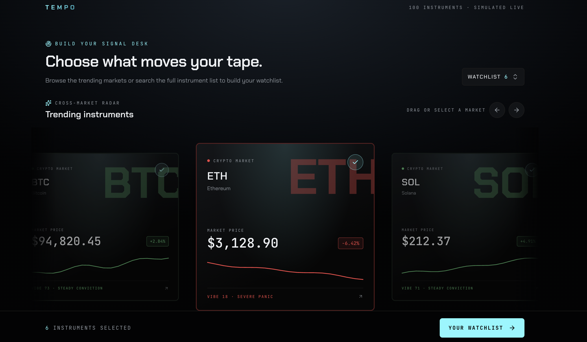
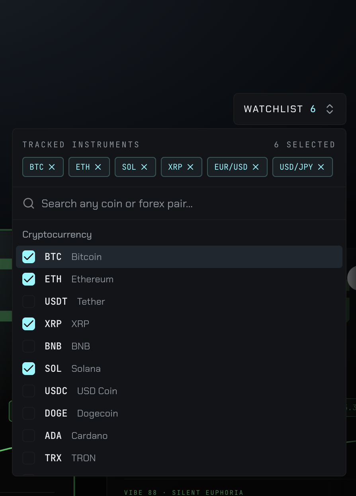
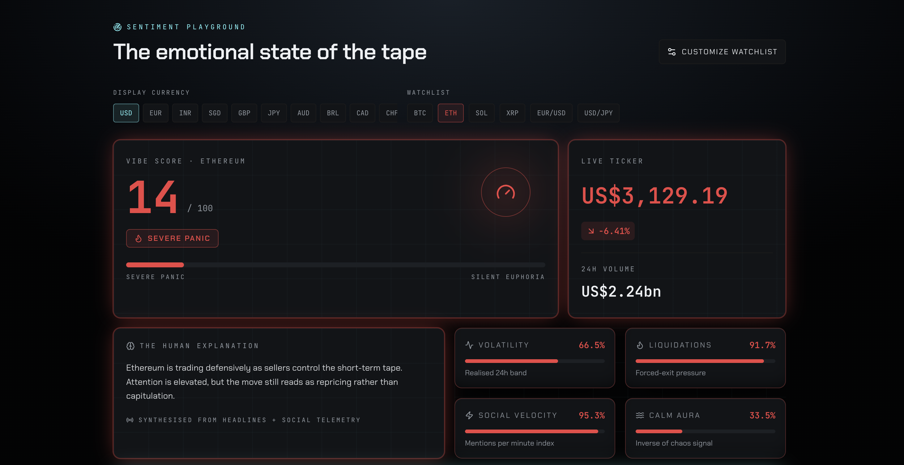

# ⚡ TEMPO — Cyber-Terminal Market Intelligence

> *Translating market chaos and live sentiment telemetry into human emotional metrics.*

[](https://tempo-1-385ibimgq-spielbergs.vercel.app/)

**Live URL:** [https://tempo-1-385ibimgq-spielbergs.vercel.app/](https://tempo-1-385ibimgq-spielbergs.vercel.app/)

---

## 🖥️️ Visual Walkthrough & Core Features

### 1. Cyber-Terminal Landing & Backdrop

* **Cursor-Reactive WebGL Neon Grid:** An immersive background environment that shifts and reacts dynamically to cursor movement[span_0](start_span)[span_0](end_span).
* **Radiant Wordmark Logo:** Engineered with a multi-stop gradient featuring a white-hot center core, atmospheric neon glow effects[span_1](start_span)[span_1](end_span), and the core mission statement.

---

### 2. Cross-Market Radar & Asset Selector (Carousel)

* **Build Your Signal Desk:** Browse trending markets or preview live instrument cards (such as BTC, ETH, and SOL) featuring live pricing, percentage movements, and vibe scores[span_2](start_span)[span_2](end_span).
* **Interactive Carousel:** Built with smooth autoplay cycles and a dedicated **"Your Watchlist"** launch button to lock in selected instruments[span_3](start_span)[span_3](end_span).

---

### 3. Universal Multi-Select Watchlist & Global Search

* **Dynamic Search Combobox:** Search and track *any* cryptocurrency or forex pair globally on demand[span_4](start_span)[span_4](end_span)[span_5](start_span)[span_5](end_span) (powered by CoinGecko and Frankfurter APIs[span_6](start_span)[span_6](end_span)).
* **Tracked Instruments Management:** Instantly add, filter, or remove assets (e.g., BTC, ETH, SOL, XRP, EUR/USD, USD/JPY) to customize your active monitoring workspace[span_7](start_span)[span_7](end_span).

---

### 4. Terminal Bento Grid & Emotional Sentiment Tracking

* **Display Currency Switcher:** Seamlessly convert values across global currencies (USD, EUR, INR, SGD, GBP, JPY, AUD, BRL, CAD, CHF) using live published exchange rates[span_8](start_span)[span_8](end_span).
* **3-Tier Emotional Palette:** Instantly map live market conditions into psychological metrics—such as **Severe Panic** (Crimson Red), **Neutral** (Ice Blue), and **Silent Euphoria** (Grass Green)[span_9](start_span)[span_9](end_span).
* **Deep Telemetry Bento Cards:** Includes a **Vibe Score** gauge (0–100 scale), **Live Ticker** pricing, **24H Volume** metrics[span_10](start_span)[span_10](end_span), **Volatility** bands, **Liquidations**, and **Social Velocity** indexes.

---

## 🎨 Visual Identity & Color System

* 🟢 **Grass Green (Bullish / Silent Euphoria):** Positive upward momentum and high user confidence.
* 🔵 **Ice Blue (Neutral):** Stable equilibrium and ranging market consolidation.
* 🔴 **Crimson Red (Panic / Severe Volatility):** Sharp drawdowns and high-alert panic liquidations.

---

## 🛠️ Tech Stack

* **Framework:** TanStack Start / React / Vite[span_11](start_span)[span_11](end_span)
* **Styling:** Tailwind CSS & Custom Cyber-Themed UI Components[span_12](start_span)[span_12](end_span)
* **Data APIs:** CoinGecko (Crypto) & Frankfurter (Forex)[span_13](start_span)[span_13](end_span)
* **Deployment:** Vercel[span_14](start_span)[span_14](end_span)

---

## 🚀 Future Roadmap (v2 & Beyond)

* **Audio Telemetry / Sonic Feedback:** Procedural ambient soundscapes that shift pitch based on active market sentiment ("Silent Euphoria" vs. "Severe Panic").
* **Historical Sentiment Time-Travel:** Scrub backward through past market crash dates to analyze historical vibe scores.
* **Expanded Asset Classes:** Broaden coverage into traditional commodities and equities (gold, oil, tech stocks).
* **Exportable Bento Cards:** Generate high-contrast shareable snapshots of custom watchlists for X (Twitter) and Discord.

---

## 💻 Local Development

To spin up TEMPO locally:

1. **Clone the repository:**
   ```bash
   git clone [https://github.com/rust-spielberg/Tempo-1.git](https://github.com/rust-spielberg/Tempo-1.git)
   cd Tempo-1

# ⚡ TEMPO — Cyber-Terminal Market Intelligence

> *Translating market chaos and live sentiment telemetry into human emotional metrics.*

[](https://tempo-1-385ibimgq-spielbergs.vercel.app/)

**Live Application URL:** [https://tempo-1-385ibimgq-spielbergs.vercel.app/](https://tempo-1-385ibimgq-spielbergs.vercel.app/)

---
